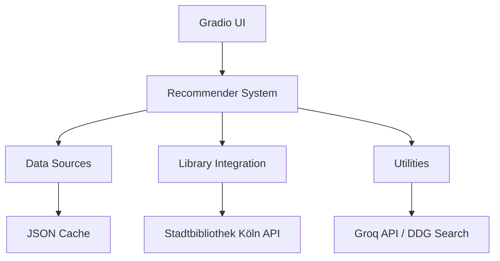

# 🏗️ Architektur

Die **Bibliothek-Empfehlungs-App** ist modular aufgebaut und trennt die Empfehlungslogik von der Benutzeroberfläche.

## 📐 Systemübersicht

## 📊 Datenfluss

1. **Start**: Beim Start lädt die App kuratierte Listen aus verschiedenen Quellen.
2. **Filterung**: Die App filtert bereits abgelehnte oder vorgeschlagene Titel.
3. **Verfügbarkeit**: Die App fragt die Website der Stadtbibliothek Köln ab, um den Echtzeit-Status zu prüfen.
4. **Anzeige**: Die App zeigt die verfügbaren Titel in der GUI an.
5. **Erweiterung**: Auf Knopfdruck werden zusätzliche Informationen über die Groq API und DuckDuckGo geladen.

## 📂 Ordnerstruktur

- `data_sources/`: Module zum Laden und Vorbereiten der Medienlisten.
- `gui/`: Definition der Gradio-Oberfläche.
- `library/`: Integration der Bibliothekssuche.
- `recommender/`: Kernlogik für die Auswahl der Empfehlungen.
- `utils/`: Hilfsfunktionen für I/O, Suche und Logging.
