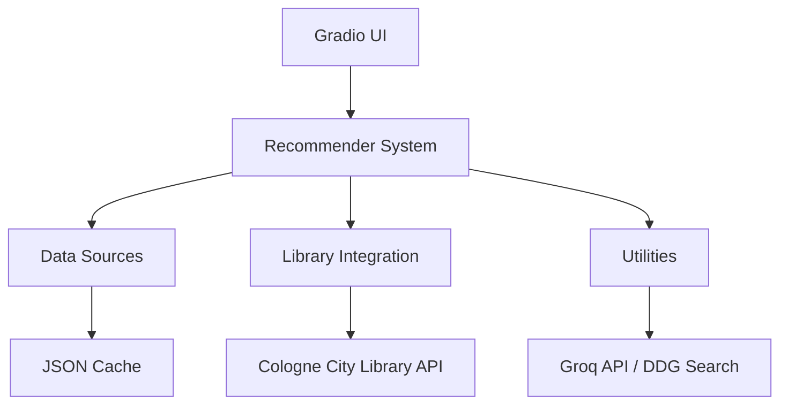

# 🏗️ Architecture

The **Library Recommender App** is modularly structured, separating the recommendation logic from the user interface.

## 📐 System Overview

## 📊 Data Flow

1. **Startup**: At startup, the app loads curated lists from various sources.
2. **Filtering**: The app filters out previously rejected or suggested titles.
3. **Availability**: The app queries the Cologne City Library website to check for real-time availability.
4. **Display**: The app displays the available titles in the GUI.
5. **Extension**: On-demand, additional information is fetched via the Groq API and DuckDuckGo.

## 📂 Folder Structure

- `data_sources/`: Modules for loading and preparing media lists.
- `gui/`: Gradio interface definition.
- `library/`: Library search integration.
- `recommender/`: Core recommendation selection logic.
- `utils/`: Utility functions for I/O, search, and logging.
